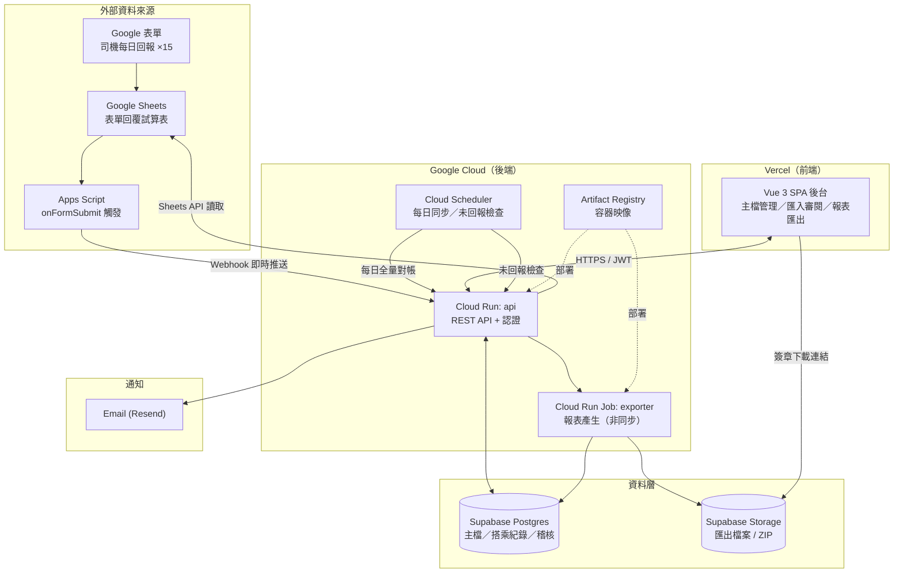

# 長照交通接送後台系統 — 系統架構與部署規劃

> 版本 v1.0 ／ 2026-08-25
> 前置閱讀：`01-需求規格與資料分析.md`

---

## 1. 架構總覽



---

## 2. 技術選型

| 層級 | 選擇 | 理由 |
|---|---|---|
| **前端** | **Vue 3（Composition API）+ TypeScript + Vite + Element Plus + Vue Router + Pinia + Axios**，建置為靜態 SPA 部署 **Vercel** | 後台是純 API 客戶端，不需 SSR。Element Plus 的表格／表單／日期元件涵蓋本案幾乎所有畫面，單頁程式碼量最少；詳見 §2.1 |
| **後端** | **Go 1.23 + Gin**，部署 **Cloud Run** | 冷啟動快、記憶體佔用小（可設 128–256MB），符合既有技術棧 |
| **資料庫** | **Supabase（PostgreSQL 15）Free Tier** | 見 §3 比較 |
| **物件儲存** | Supabase Storage | 與 DB 同一供應商，省一組憑證 |
| **認證** | Supabase Auth（Email + 密碼，含 MFA 選項） | 免費、與 DB 整合、省下自建帳號系統 |
| **排程** | Cloud Scheduler → Cloud Run HTTP（OIDC 驗證） | 免費額度 3 個 job／月，本案剛好夠用 |
| **Excel 產生** | `excelize` 產 `.xlsx` | 政府平台接受 `.xlsx`，不需 `.xls` 轉檔方案 |
| **通知** | Email（Resend） | 未回報提醒與月底提醒皆寄給管理者；不採 LINE，省下官方帳號與 token 維運 |
| **CI/CD** | GitHub Actions（後端）＋ Vercel Git 整合（前端） | 配合部署平台 |
| **監控** | Cloud Logging ＋ Cloud Monitoring 告警 ＋ Sentry Free | |

### 2.1 前端選型說明

後端是獨立的 Go API，前端只負責畫面與呼叫 API，**沒有任何 SSR、SEO 或伺服器渲染需求**（整個後台在登入牆後面）。因此選一個純 SPA 框架，不引入 Next.js 這類全端框架的 server／client 邊界概念。

| 元件 | 選擇 | 說明 |
|---|---|---|
| 框架 | Vue 3 Composition API + `<script setup>` | 單一 `.vue` 檔內含模板、邏輯、樣式，非前端背景者容易讀懂與修改 |
| 建置 | Vite | 啟動與熱更新快，`npm run build` 產出純靜態檔 |
| UI 元件 | **Element Plus** | 本案的關鍵。`el-table`（分頁／排序／篩選／凍結欄）、`el-form`（驗證）、`el-date-picker`、`el-upload`、`el-dialog` 直接覆蓋主檔 CRUD、月曆矩陣、匯入預覽、匯出設定等幾乎所有畫面；官方文件有完整繁中／簡中版 |
| 路由 | Vue Router | 以 `meta.roles` 做路由層權限控管（見 §8） |
| 狀態 | Pinia | **只放登入者資訊與權限**。列表、明細等伺服器資料一律由頁面自己取，不進 store，避免狀態同步問題 |
| HTTP | Axios | 單一 instance + 攔截器統一處理 JWT 附加、401 導回登入、錯誤訊息轉 `ElMessage` |

**Element Plus 採按需匯入**，`vite.config.ts` 掛 `unplugin-vue-components` 的 `ElementPlusResolver`，元件不必逐一 import 也能 tree-shaking：

```ts
// vite.config.ts（摘要）
import Components from 'unplugin-vue-components/vite'
import { ElementPlusResolver } from 'unplugin-vue-components/resolvers'

export default defineConfig({
  plugins: [
    vue(),
    Components({
      resolvers: [ElementPlusResolver()],
      dts: 'src/components.d.ts',   // 自動產生型別，編輯器有補全
    }),
  ],
})
```

### 為什麼後端不放 Vercel Functions？
匯出作業會一次讀取整月 × 全部個案並產生數十個 Excel 檔，Vercel Hobby 的函式執行時間上限（10 秒 / Pro 60 秒）不足；Cloud Run 可設到 60 分鐘，且能長駐連線池。

---

## 3. 資料庫選型比較

| 方案 | 免費額度 | 優點 | 缺點 | 評估 |
|---|---|---|---|---|
| **Supabase**（PostgreSQL） | 500MB DB、1GB Storage、無限 API 請求 | 附 Auth + Storage + 即時訂閱、有 connection pooler、備份介面完整 | 免費層專案**閒置 7 天會暫停**（本案每日有排程，不會觸發）；免費層無自動 PITR | ⭐ **建議採用** |
| **Neon**（PostgreSQL） | 0.5GB、自動 scale-to-zero | serverless driver 對 Cloud Run 連線友善、branch 功能適合測試 | 無內建 Auth／Storage，需另找 | 次選 |
| **Cloud SQL** | 無免費層 | 與 Cloud Run 同 VPC、延遲最低、管理成熟 | 最小規格約 US$9–15／月 | 量大後升級選項 |
| **EC2 自架 PostgreSQL** | 首年 t3.micro 免費 | 完全掌控 | 需自行負責備份、更新、安全性修補；長照個資出事責任重 | ❌ 不建議 |
| **Firestore** | 有免費層 | 免管理 | 本案是高度關聯的報表查詢，NoSQL 反而更麻煩 | ❌ 不適合 |

**結論**：採 **Supabase Free 起步**，資料量成長後升級 Pro（US$25／月）即可，遷移成本低（標準 PostgreSQL）。

> **連線池注意事項**：Cloud Run 每個執行個體都會開自己的連線，橫向擴充時容易打爆 Postgres 連線上限。**必須**透過 Supabase 的 Transaction Pooler（port 6543）連線，並在應用端設定 `MaxOpenConns = 5`、`MaxIdleConns = 2`，同時把 Cloud Run 的 `max-instances` 限制在 5～10。

---

## 4. Google 表單資料串接設計

採 **雙軌並行**，兼顧即時性與完整性：

### 4.1 即時軌：Apps Script Webhook
在每份表單回覆試算表加掛 Apps Script，`onFormSubmit` 觸發時把整列資料 POST 到後端：

```
POST /api/v1/ingest/google-form
Header: X-Ingest-Token: <每份表單獨立的長期密鑰>
Body:   { formId, sheetName, submittedAt, values: { "欄名": "值", ... } }
```

優點：司機一送出就進系統，未回報通知才有意義。

### 4.2 對帳軌：每日 Sheets API 全量比對
Cloud Scheduler 每日 02:00 觸發後端，用 Service Account 透過 Google Sheets API 讀取全部 15 份試算表當月資料，與資料庫比對：

- 資料庫沒有的列 → 補寫入（webhook 漏送、Apps Script 額度用盡時的救援）
- 內容不一致 → 以試算表為準更新，並記錄差異
- 試算表有新欄位 → 進入「待對應佇列」

> **Service Account 設定**：在 GCP 建立 Service Account，把它的 email 加為每份試算表的「檢視者」即可，不需 OAuth 授權流程。

### 4.3 欄位對應機制（本系統成敗關鍵）

由於欄名不穩定（見文件 01 §4.2），採「人工綁定 + 系統輔助」：

1. 系統偵測到新欄名時，用模糊比對（去除序號、括號註記、Unicode 正規化後比對姓名）**推薦**最可能的個案，但**不自動套用**。
2. 管理者在後台「欄位對應」頁面確認或修正綁定，一次設定長期有效。
3. 未綁定欄位的資料**照樣原封不動存入 raw 表**，等綁定後再重新正規化，**不會遺失資料**。
4. 欄名變更時（例如表單改版），舊綁定保留、新欄名進佇列，兩者並存不衝突。

### 4.4 表單改版切換

表單題目標題改為帶系統個案編號（`[C0123] 張詹竹妹 [去程]`），讓匯入端精準對應，省下欄位對應表的長期維護成本。

兩項限制決定了切換方式：

- 改題目標題**不會**弄丟既有回覆 —— `forms.batchUpdate` 的 `UpdateItemRequest` 只改 `title`，`itemId` / `questionId` 不變。
- 改題目標題**也不會**更新已連結回覆試算表的標題列 —— 標題列維持題目建立當下的文字，新回應仍寫進原欄。這正是 §4.3 所述欄名不穩定的成因。必須**取消連結並重新建立回覆試算表**，新標題列才會採用新題目文字。

切換步驟，**每台車獨立進行、排在申報月交界**：

| 步驟 | 動作 | 注意 |
|---|---|---|
| 1 | 確認該車當月資料已完成匯入與匯出 | 避免同月資料橫跨兩份試算表 |
| 2 | 用 Forms API `batchUpdate` / `UpdateItemRequest` 改題目標題為 `[個案編號] 姓名 [方向]` | `itemId` 不變，歷史回覆保留 |
| 3 | Forms → 回覆 → 取消連結試算表，再重新建立 | 產生新試算表，標題列採用新題目文字 |
| 4 | 舊試算表改名歸檔（例如加 `-archived` 後綴），**不刪除** | 歷史月份仍需可重跑匯入 |
| 5 | 在 `google_forms` 新增一筆指向新試算表，舊筆 `active = false` | 兩筆同指一台車，`spreadsheet_id + sheet_name` 唯一鍵天然區隔；舊欄名綁定保留不動，歷史月份仍可重跑匯入與匯出 |
| 6 | 新試算表首次同步時，系統解析 `[C0123]` **自動建立綁定建議**，管理者按一次確認 | 仍不自動套用，維持「絕不靜默對應」 |
| 7 | 在新試算表加掛 Apps Script（§4.1），並把 Service Account 加為檢視者（§4.2） | 兩項都要重做，否則即時軌與對帳軌雙雙失效 |

> 第 7 步最容易漏。切換後務必送一筆測試回覆，確認 webhook 有進 `form_submissions`。

---

## 5. 部署與 CI/CD

### 5.1 環境

| 環境 | 前端 | 後端 | 資料庫 |
|---|---|---|---|
| 開發 | 本機 `npm run dev`（Vite） | 本機 `go run` / Docker Compose | 本機 Postgres（Docker） |
| 預備（staging） | Vercel Preview（PR 自動產生） | Cloud Run `api-staging` | Supabase 專案 staging |
| 正式 | Vercel Production | Cloud Run `api-prod` | Supabase 專案 prod |

### 5.2 儲存庫結構（解耦 Monorepo）

專案採用 **無跨層依賴的解耦 Monorepo（Decoupled Monorepo）** 管理。前端與後端置於同一儲存庫下但完全獨立，無 `packages/` 共用層，未來若需拆分為獨立 Git 儲存庫可無痛遷移：

```
ltc-transport-system/
├── docs/                    # 系統規格與 API 設計文件
├── apps/
│   ├── web/                 # 100% 獨立的前端專案 (Vue 3 + Vite SPA，部署 Vercel)
│   │   ├── package.json     # 自有 npm 依賴（無 monorepo workspace 工具負擔）
│   │   ├── vite.config.ts   # Vite 設定（含本機 API 代理反向轉發）
│   │   └── src/
│   │       ├── api/         # Axios instance 與各資源 API 呼叫函式
│   │       ├── types/       # 前端自主維護的 TypeScript 型別與 DTO
│   │       ├── views/       # 頁面（對應文件 03 §6 路由表）
│   │       ├── components/  # 共用元件（Element Plus 封裝）
│   │       ├── stores/      # Pinia（僅 auth）
│   │       └── router/      # Vue Router + 權限 meta
│   └── api/                 # 100% 獨立的後端專案 (Go 1.23 + Gin，部署 Cloud Run)
│       ├── go.mod           # 自有 Go module 依賴
│       ├── go.sum
│       ├── Dockerfile       # 獨立的後端容器建置設定
│       ├── cmd/
│       │   ├── server/      # REST API 伺服器進入點
│       │   └── exporter/    # Cloud Run Job 報表產生器進入點
│       ├── internal/
│       │   ├── domain/      # 實體與業務規則（R1–R9）
│       │   ├── repository/  # 資料存取（PostgreSQL）
│       │   ├── service/     # 匯入、合併、匯出
│       │   ├── export/      # Excel 樣板與產生器（excelize）
│       │   └── handler/     # HTTP 路由與 Controller
│       └── migrations/      # SQL migration（golang-migrate）
└── .github/workflows/       # GitHub Actions（路徑分流 CI/CD）
```

#### 前後端介面契約管理（無共用層機制）
1. **型別獨立管理**：前端在 `apps/web/src/types/` 自行維護 DTO 介面，依據 `03-資料模型與API設計.md` 規範定義，完全不引用後端程式碼。
2. **自動化產生（選用）**：若需同步後端 API 規格，前端可透過 `apps/web/package.json` 中的 `npm run gen:types` 指令直接由後端 Swagger/OpenAPI 自動輸出至 `src/types/api.d.ts`，產物保留在前端專案內部。
3. **零跨目錄依賴**：`apps/web` 與 `apps/api` 的 `npm install` 與 `go build` 完全不需存取對方的目錄或依賴，建置與部署完全解耦。


### 5.3 GitHub Actions

**`.github/workflows/api.yml`**（推 `main` 且 `apps/api/**` 有異動時觸發）

```yaml
name: Deploy API
on:
  push:
    branches: [main]
    paths: ['apps/api/**', '.github/workflows/api.yml']

jobs:
  test:
    runs-on: ubuntu-latest
    steps:
      - uses: actions/checkout@v4
      - uses: actions/setup-go@v5
        with: { go-version: '1.23' }
      - run: go vet ./...
      - run: go test ./... -race -cover
        working-directory: apps/api

  deploy:
    needs: test
    runs-on: ubuntu-latest
    permissions:
      contents: read
      id-token: write          # Workload Identity Federation 必要
    steps:
      - uses: actions/checkout@v4
      - uses: google-github-actions/auth@v2
        with:
          workload_identity_provider: ${{ secrets.GCP_WIF_PROVIDER }}
          service_account: ${{ secrets.GCP_DEPLOY_SA }}
      - uses: google-github-actions/setup-gcloud@v2
      - name: Build & push
        run: |
          gcloud builds submit apps/api \
            --tag asia-east1-docker.pkg.dev/$PROJECT/ltc/api:${{ github.sha }}
      - name: Run migrations
        run: |
          gcloud run jobs execute migrate --region asia-east1 --wait
      - name: Deploy
        run: |
          gcloud run deploy api-prod \
            --image asia-east1-docker.pkg.dev/$PROJECT/ltc/api:${{ github.sha }} \
            --region asia-east1 \
            --min-instances 0 --max-instances 5 \
            --memory 512Mi --cpu 1 --timeout 900 \
            --no-allow-unauthenticated \
            --set-secrets DATABASE_URL=db-url:latest,RESEND_API_KEY=resend-key:latest
```

重點：

- **用 Workload Identity Federation，不要把 GCP JSON 金鑰塞進 GitHub Secrets**。
- Migration 獨立成 Cloud Run Job，先跑完再部署新版程式。
- `--min-instances 0` 讓閒置時零成本；月底尖峰再視情況調成 1 以避免冷啟動。
- 區域選 **asia-east1（彰化）**，離使用者最近。

**前端**：直接用 Vercel 的 Git 整合（推 `main` 自動部署、PR 自動產生 Preview），Framework Preset 選 **Vite**，Root Directory 設 `apps/web`。

SPA 需要 rewrite 規則，否則直接輸入 `/cases/12` 這類網址會 404：

```json
// apps/web/vercel.json
{ "rewrites": [{ "source": "/(.*)", "destination": "/index.html" }] }
```

### 5.4 機密管理

| 機密 | 存放位置 |
|---|---|
| 資料庫連線字串、Resend API Key、Google SA 金鑰 | **GCP Secret Manager**，Cloud Run 以 `--set-secrets` 掛載 |
| Vercel 端的 API base URL、Supabase anon key | Vercel Environment Variables |
| GitHub Actions 的部署身分 | Workload Identity Federation（無長期金鑰） |
| 表單 ingest token | Secret Manager，每份表單一組，可個別輪替 |

---

## 6. 成本估算（月）

| 項目 | 用量估計 | 成本 |
|---|---|---|
| Vercel Hobby | 靜態 SPA、低流量 | **US$0** |
| Cloud Run | 每日約 200 次請求 + 月底匯出，遠低於免費額度（200 萬次請求／月） | **US$0** |
| Cloud Scheduler | 2 個 job（免費 3 個） | **US$0** |
| Artifact Registry | 約 1GB 映像 | 約 **US$0.1** |
| Supabase Free | 500MB DB、1GB Storage | **US$0** |
| Secret Manager | 6 組密鑰 | 約 **US$0.06** |
| Resend Email | 每月 <3,000 封（免費額度） | **US$0** |
| **合計** | | **約 US$0.2／月（≈ NT$6）** |

> 若客戶要求正式營運等級（Supabase Pro US$25 + Vercel Pro US$20 + Cloud Run min-instance 1 約 US$8），月成本約 **US$53（≈ NT$1,700）**。建議先跑免費層，上線穩定後再評估。

---

## 7. 技術風險與對策

| # | 風險 | 影響 | 對策 |
|---|---|---|---|
| **R-1** | 系統產出的 `.xlsx` 雖符合欄位規格，仍可能因編碼、檔名或儲存格格式被政府平台退件 | 月底申報卡關 | Sprint 4 拿系統產出的實檔上傳政府平台驗證一次（文件 04 §3 AC-3），不等到正式申報才發現 |
| **R-2** | 表單改版切換時漏掛 Apps Script 或 Service Account 權限 | 該車即時回報與每日對帳同時失效，且不會報錯，可能整月無資料 | 依 §4.4 步驟逐車切換，每車切換後送一筆測試回覆驗證；`google_forms.last_synced_at` 超過 48 小時未更新即發告警 |
| **R-3** | Google 表單欄名持續變動、序號重複、異體字 | 匯入對應錯誤 → 申報資料錯人 | 欄位對應表 + 人工確認機制（§4.3）；未對應絕不猜測；每次匯入產生對應報表 |
| **R-4** | Apps Script 每日執行額度用盡或指令碼被停用 | 即時回報中斷 | 每日 Sheets API 全量對帳作為安全網（§4.2） |
| **R-5** | Cloud Run 擴充導致 Postgres 連線耗盡 | 服務中斷 | 強制走 Transaction Pooler、限制 `max-instances` 與連線池大小（§3） |
| **R-6** | 混車與四趟規則理解有誤 | 申報趟數錯誤，影響請款 | 用 115 年 7 月實際資料做**回歸驗證**：系統產出 vs 客戶人工產出的 `蔡曾切11507.xls` 需逐欄一致 |
| **R-7** | 個資外洩 | 法律責任 | 欄位級加密、存取軌跡、最小權限、匯出檔案 24 小時後自動失效的簽章連結 |
| **R-8** | 客戶需求持續擴張（記帳、核銷、成本） | 交期失控 | 依 P0→P3 分批交付，每批驗收後才進下一批（客戶已同意「做完一部分就丟給我們」） |
| **R-9** | Supabase 免費層專案閒置暫停 | 服務中斷 | 每日排程本身即為心跳；另加 Cloud Monitoring 對 `/api/health` 的可用性檢查 |

---

## 8. 安全設計要點

- **傳輸**：全站 HTTPS；Cloud Run 設 `--no-allow-unauthenticated`，前端透過 Supabase JWT 驗證後由後端驗簽。
- **身分證欄位**：以 AES-256-GCM 加密後存放（金鑰放 Secret Manager），查詢用途另存 HMAC 索引欄位供精準比對。
- **畫面遮罩**：清單頁一律顯示遮罩值，需點選「顯示完整」才解遮，且該動作寫入存取軌跡。
- **匯出檔案**：存 Supabase Storage 私有 bucket，只發放 24 小時有效的簽章 URL。
- **稽核表**：`audit_log` 記錄 `actor / action / entity / before / after / ip / at`，僅可新增不可修改。
- **權限**：後端統一在 middleware 檢查角色；資料庫層另開 Row Level Security 作為第二道防線。
