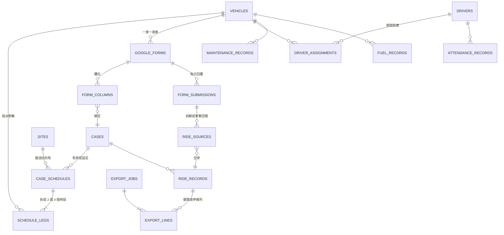

# 長照交通接送後台系統 — 資料模型與 API 設計

> 版本 v1.0 ／ 2026-08-25
> 前置閱讀：`01-需求規格與資料分析.md`、`02-系統架構與部署規劃.md`

---

## 1. 實體關聯圖



---

## 2. 資料表定義

### 2.1 主檔

```sql
-- 個案
CREATE TABLE cases (
  id                  BIGSERIAL PRIMARY KEY,
  code                TEXT NOT NULL UNIQUE,          -- 系統編號，如 C0123（供 Google 表單欄名使用）
  name                TEXT NOT NULL,
  name_normalized     TEXT NOT NULL,                 -- Unicode NFKC + 異體字正規化，供模糊比對
  national_id_enc     BYTEA NOT NULL,                -- AES-256-GCM 密文
  national_id_hmac    BYTEA NOT NULL UNIQUE,         -- HMAC-SHA256，供精準查詢與唯一性檢查
  home_address        TEXT NOT NULL,
  region              TEXT NOT NULL CHECK (region IN ('miaoli','hsinchu')),
  ltc_level           TEXT,                          -- 長照失能等級／給付碼；人工建檔，不進政府表單 33 欄
  service_category    SMALLINT NOT NULL DEFAULT 1 CHECK (service_category IN (1,2)),   -- 1補助 2自費
  service_usage_type  SMALLINT NOT NULL CHECK (service_usage_type BETWEEN 1 AND 4),    -- 政府表單第 33 欄
  claim_start_date    DATE NOT NULL,                 -- 幾號開始申報（規則 R8）
  claim_end_date      DATE,                          -- 停案日
  status              TEXT NOT NULL DEFAULT 'active' CHECK (status IN ('active','suspended','closed')),
  note                TEXT,
  created_at          TIMESTAMPTZ NOT NULL DEFAULT now(),
  updated_at          TIMESTAMPTZ NOT NULL DEFAULT now()
);
CREATE INDEX idx_cases_region_status ON cases(region, status);
CREATE INDEX idx_cases_name_norm ON cases(name_normalized);

-- 據點
CREATE TABLE sites (
  id          BIGSERIAL PRIMARY KEY,
  name        TEXT NOT NULL,
  address     TEXT NOT NULL,
  region      TEXT NOT NULL,
  open_days   SMALLINT[] NOT NULL DEFAULT '{1,2,3,4,5}',  -- ISO 星期：1=一 … 7=日
  status      TEXT NOT NULL DEFAULT 'active',
  UNIQUE (name, region)
);

-- 車輛
CREATE TABLE vehicles (
  id            BIGSERIAL PRIMARY KEY,
  plate_no      TEXT NOT NULL UNIQUE,     -- 車號，如 BZG-7915（政府表單第 32 欄）
  display_name  TEXT NOT NULL UNIQUE,     -- 車名，如「竹北一車」
  region        TEXT NOT NULL,
  seats         SMALLINT,
  status        TEXT NOT NULL DEFAULT 'active'
);

-- 司機
CREATE TABLE drivers (
  id                BIGSERIAL PRIMARY KEY,
  name              TEXT NOT NULL,
  name_normalized   TEXT NOT NULL,
  national_id_enc   BYTEA NOT NULL,       -- 政府表單第 7 欄
  national_id_hmac  BYTEA NOT NULL UNIQUE,
  phone             TEXT,
  email             TEXT,
  status            TEXT NOT NULL DEFAULT 'active'
);

-- 司機與車輛的期間對應（司機會換車、代班）
CREATE TABLE driver_assignments (
  id             BIGSERIAL PRIMARY KEY,
  vehicle_id     BIGINT NOT NULL REFERENCES vehicles(id),
  driver_id      BIGINT NOT NULL REFERENCES drivers(id),
  effective_from DATE NOT NULL,
  effective_to   DATE,                    -- NULL = 迄今
  is_primary     BOOLEAN NOT NULL DEFAULT true,
  EXCLUDE USING gist (
    vehicle_id WITH =,
    daterange(effective_from, COALESCE(effective_to,'infinity'::date), '[]') WITH &&
  ) WHERE (is_primary)
);
```

> `EXCLUDE USING gist` 讓資料庫本身保證「同一台車在同一天不會有兩個主要司機」，比在應用層檢查可靠。需先 `CREATE EXTENSION btree_gist;`

### 2.2 排班設定（政府表單 30 個靜態欄位的來源）

```sql
CREATE TABLE case_schedules (
  id                   BIGSERIAL PRIMARY KEY,
  case_id              BIGINT NOT NULL REFERENCES cases(id),
  site_id              BIGINT NOT NULL REFERENCES sites(id),
  effective_from       DATE NOT NULL,
  effective_to         DATE,
  weekdays             SMALLINT[] NOT NULL,        -- 每週搭乘日，如 {1,2,3,4,5}
  trip_pattern         SMALLINT NOT NULL CHECK (trip_pattern IN (2,4)),  -- 規則 R4
  service_code         TEXT NOT NULL DEFAULT 'BD03',
  unit_price           NUMERIC(8,2) NOT NULL DEFAULT 115,   -- 逐案人工維護，115 僅為建檔預設
  distance_km          NUMERIC(6,2) NOT NULL,               -- 人工輸入，不由地圖 API 計算
  service_duration_min SMALLINT NOT NULL DEFAULT 10,        -- 逐案人工維護，10 僅為建檔預設（規則 R3）
  note                 TEXT,
  CHECK (effective_to IS NULL OR effective_to >= effective_from)
);
CREATE INDEX idx_sched_case_period ON case_schedules(case_id, effective_from, effective_to);
```

> **`unit_price`、`distance_km`、`service_duration_min` 三欄一律逐案人工維護。** `DEFAULT` 只在建檔時帶入初始值，**UI 必須把三者都顯示成可編輯欄位，不得隱藏或設為唯讀**；批次匯入時若來源檔缺這幾欄，`distance_km` 因 `NOT NULL` 無預設會直接擋下，另兩欄則帶預設並在匯入預覽中標示「使用預設值，請確認」。

```sql

-- 每個時段一列：2 趟 → 2 列，4 趟 → 4 列
CREATE TABLE schedule_legs (
  id           BIGSERIAL PRIMARY KEY,
  schedule_id  BIGINT NOT NULL REFERENCES case_schedules(id) ON DELETE CASCADE,
  leg_seq      SMALLINT NOT NULL CHECK (leg_seq BETWEEN 1 AND 4),
  direction    TEXT NOT NULL CHECK (direction IN ('outbound','inbound')),  -- 去程／回程
  period       TEXT NOT NULL CHECK (period IN ('am','pm')),                -- 上午／下午段
  depart_time  TIME NOT NULL,                                              -- 政府表單第 8、9 欄
  vehicle_id   BIGINT NOT NULL REFERENCES vehicles(id),
  UNIQUE (schedule_id, leg_seq)
);
```

**設計說明**：把「2 趟 / 4 趟」統一成 leg 清單，是本系統最重要的一個抽象。匯出時不需要 `if 四趟 then ... else ...` 的分支，一律走同一條路徑展開，規則 R4 自然被涵蓋。

| 趟數型態 | leg 1 | leg 2 | leg 3 | leg 4 |
|---|---|---|---|---|
| 2 趟 | am／去程 08:00 | am／回程 12:00 | — | — |
| 4 趟 | am／去程 08:00 | am／回程 11:00 | pm／去程 13:00 | pm／回程 16:00 |

### 2.3 Google 表單與欄位對應

```sql
CREATE TABLE google_forms (
  id              BIGSERIAL PRIMARY KEY,
  display_name    TEXT NOT NULL,               -- 「竹北一車 (回覆)」
  spreadsheet_id  TEXT NOT NULL,
  sheet_name      TEXT NOT NULL DEFAULT '表單回覆 1',
  vehicle_id      BIGINT NOT NULL REFERENCES vehicles(id),
  ingest_secret_ref TEXT NOT NULL,             -- Secret Manager 中的密鑰名稱
  active          BOOLEAN NOT NULL DEFAULT true,
  last_synced_at  TIMESTAMPTZ,
  UNIQUE (spreadsheet_id, sheet_name)
);

CREATE TABLE form_columns (
  id             BIGSERIAL PRIMARY KEY,
  form_id        BIGINT NOT NULL REFERENCES google_forms(id),
  raw_title      TEXT NOT NULL,                -- 原始欄名，如「1.陳素貞(4趟)*可能下午回竹1車載 [(早午)去程]」
  column_index   SMALLINT NOT NULL,
  kind           TEXT NOT NULL CHECK (kind IN ('meta','ride','issue','unknown')),
  case_id        BIGINT REFERENCES cases(id),  -- 綁定的個案（kind='ride' 時必填）
  leg_seq        SMALLINT,                     -- 綁定的時段
  mapping_status TEXT NOT NULL DEFAULT 'pending'
                 CHECK (mapping_status IN ('pending','mapped','ignored')),
  suggested_case_id BIGINT REFERENCES cases(id),   -- 系統推薦（僅供參考，不自動套用）
  suggestion_score  NUMERIC(4,3),
  first_seen_at  TIMESTAMPTZ NOT NULL DEFAULT now(),
  mapped_by      UUID, mapped_at TIMESTAMPTZ,
  UNIQUE (form_id, raw_title)
);
CREATE INDEX idx_form_columns_pending ON form_columns(form_id) WHERE mapping_status = 'pending';
```

### 2.4 每日回報（raw → 正規化 → 合併）

```sql
-- 第 1 層：原始回覆，永不修改
CREATE TABLE form_submissions (
  id               BIGSERIAL PRIMARY KEY,
  form_id          BIGINT NOT NULL REFERENCES google_forms(id),
  service_date     DATE NOT NULL,              -- 取自「今天日期」欄，非時間戳記
  submitted_at     TIMESTAMPTZ NOT NULL,
  driver_name_raw  TEXT,
  driver_id        BIGINT REFERENCES drivers(id),
  issue_text       TEXT,                       -- 「問題回報」欄
  payload          JSONB NOT NULL,             -- 完整原始列
  source           TEXT NOT NULL CHECK (source IN ('webhook','sheets_sync','manual')),
  created_at       TIMESTAMPTZ NOT NULL DEFAULT now(),
  UNIQUE (form_id, service_date, submitted_at)
);

-- 第 2 層：拆成單筆回報（一個欄位一筆）
CREATE TABLE ride_sources (
  id             BIGSERIAL PRIMARY KEY,
  submission_id  BIGINT NOT NULL REFERENCES form_submissions(id) ON DELETE CASCADE,
  form_column_id BIGINT NOT NULL REFERENCES form_columns(id),
  case_id        BIGINT NOT NULL REFERENCES cases(id),
  service_date   DATE NOT NULL,
  leg_seq        SMALLINT NOT NULL,
  vehicle_id     BIGINT NOT NULL REFERENCES vehicles(id),
  driver_id      BIGINT REFERENCES drivers(id),
  reported       TEXT NOT NULL CHECK (reported IN ('boarded','absent')),  -- 有坐／沒坐
  UNIQUE (submission_id, form_column_id)
);
CREATE INDEX idx_ride_sources_key ON ride_sources(case_id, service_date, leg_seq);

-- 第 3 層：合併後的單一事實（規則 R5）
CREATE TABLE ride_records (
  id                BIGSERIAL PRIMARY KEY,
  case_id           BIGINT NOT NULL REFERENCES cases(id),
  service_date      DATE NOT NULL,
  leg_seq           SMALLINT NOT NULL,
  schedule_id       BIGINT NOT NULL REFERENCES case_schedules(id),
  merged_status     TEXT NOT NULL CHECK (merged_status IN ('boarded','absent','unreported')),
  effective_status  TEXT NOT NULL CHECK (effective_status IN ('boarded','absent','unreported')),
  vehicle_id        BIGINT REFERENCES vehicles(id),   -- 實際承載車輛（混車時取回報有坐者）
  driver_id         BIGINT REFERENCES drivers(id),
  has_conflict      BOOLEAN NOT NULL DEFAULT false,   -- 兩車皆回報有坐（規則 R5）
  conflict_resolved_by UUID,                          -- 人工指定車輛／司機者
  conflict_resolved_at TIMESTAMPTZ,
  not_claimed_aa09  BOOLEAN NOT NULL DEFAULT false,   -- 政府表單第 17 欄，勾選時輸出 '1'
  override_reason   TEXT,                             -- 規則 R7：人工覆寫必填
  overridden_by     UUID,
  overridden_at     TIMESTAMPTZ,
  updated_at        TIMESTAMPTZ NOT NULL DEFAULT now(),
  UNIQUE (case_id, service_date, leg_seq),
  CHECK (
    (effective_status = merged_status AND override_reason IS NULL)
    OR (override_reason IS NOT NULL AND overridden_by IS NOT NULL)
  ),
  CHECK (
    (conflict_resolved_by IS NULL) = (conflict_resolved_at IS NULL)
  )
);
CREATE INDEX idx_ride_records_month ON ride_records(service_date, case_id);
```

> **`merged_status` 與 `effective_status` 分兩欄是刻意的**：前者永遠是司機回報合併後的事實，後者才是拿去申報的值。兩者不同時，資料庫層的 `CHECK` 強制必須有覆寫原因與操作者。規則 R7 的稽核需求由此得到結構性保證，而不是靠程式自律。

### 2.5 匯出

```sql
CREATE TABLE export_jobs (
  id          BIGSERIAL PRIMARY KEY,
  job_type    TEXT NOT NULL CHECK (job_type IN ('gov_claim','trip_summary','hsinchu_schedule','payroll','maintenance_blank')),
  period_ym   CHAR(6) NOT NULL,               -- 民國年月，如 '11507'（補零至 6 碼便於排序）
  scope       JSONB NOT NULL,                 -- {region, vehicleIds, caseIds, mode:'per_case'|'combined'}
  status      TEXT NOT NULL DEFAULT 'pending'
              CHECK (status IN ('pending','running','succeeded','failed')),
  precheck    JSONB,                          -- 前置檢核結果
  file_path   TEXT, file_size BIGINT, checksum TEXT,
  error       TEXT,
  created_by  UUID NOT NULL,
  created_at  TIMESTAMPTZ NOT NULL DEFAULT now(),
  finished_at TIMESTAMPTZ
);

-- 每次匯出的實際內容快照，供日後追查「當初送出去的是什麼」
CREATE TABLE export_lines (
  id           BIGSERIAL PRIMARY KEY,
  job_id       BIGINT NOT NULL REFERENCES export_jobs(id) ON DELETE CASCADE,
  case_id      BIGINT NOT NULL REFERENCES cases(id),
  row_no       INT NOT NULL,
  columns      JSONB NOT NULL                 -- 33 欄的完整內容
);
```

### 2.6 稽核與其他

```sql
CREATE TABLE audit_log (
  id          BIGSERIAL PRIMARY KEY,
  actor_id    UUID NOT NULL,
  actor_email TEXT NOT NULL,
  action      TEXT NOT NULL,        -- create/update/delete/export/reveal_pii/override
  entity      TEXT NOT NULL,
  entity_id   TEXT NOT NULL,
  before      JSONB, after JSONB,
  ip          INET, user_agent TEXT,
  at          TIMESTAMPTZ NOT NULL DEFAULT now()
);
-- 僅允許 INSERT
REVOKE UPDATE, DELETE ON audit_log FROM PUBLIC;

CREATE TABLE maintenance_records (        -- F8 車輛維修保養
  id BIGSERIAL PRIMARY KEY,
  vehicle_id BIGINT NOT NULL REFERENCES vehicles(id),
  occurred_on DATE NOT NULL, category TEXT, vendor TEXT,
  amount NUMERIC(10,2), odometer INT, description TEXT,
  created_by UUID, created_at TIMESTAMPTZ DEFAULT now()
);

CREATE TABLE fuel_records (               -- F7 油資（司機代墊）
  id BIGSERIAL PRIMARY KEY,
  vehicle_id BIGINT NOT NULL REFERENCES vehicles(id),
  driver_id BIGINT NOT NULL REFERENCES drivers(id),
  fueled_on DATE NOT NULL, liters NUMERIC(6,2), amount NUMERIC(10,2),
  receipt_path TEXT, settled_in_period CHAR(6)
);

CREATE TABLE attendance_records (         -- F7 出勤／請假
  id BIGSERIAL PRIMARY KEY,
  driver_id BIGINT NOT NULL REFERENCES drivers(id),
  work_date DATE NOT NULL,
  status TEXT NOT NULL CHECK (status IN ('work','leave','sick','off')),
  note TEXT,
  UNIQUE (driver_id, work_date)
);

-- 系統層級開關（目前唯一用途：規則 R7 人工覆寫的總閘門）
CREATE TABLE app_settings (
  key         TEXT PRIMARY KEY,
  value       JSONB NOT NULL,
  updated_by  UUID NOT NULL,
  updated_at  TIMESTAMPTZ NOT NULL DEFAULT now()
);
INSERT INTO app_settings (key, value, updated_by) VALUES
  ('allow_manual_override', 'false'::jsonb, '00000000-0000-0000-0000-000000000000');

CREATE TABLE notification_log (           -- F4
  id BIGSERIAL PRIMARY KEY,
  channel TEXT NOT NULL DEFAULT 'email', target TEXT NOT NULL,
  topic TEXT NOT NULL, body TEXT NOT NULL,
  sent_at TIMESTAMPTZ DEFAULT now(), success BOOLEAN, error TEXT
);
```

---

## 3. 政府申報表欄位對應表（實作依據）

| 欄 | 標題 | 取值邏輯 |
|---|---|---|
| 1 | 身分證字號 | `cases.national_id`（解密） |
| 2 | 服務日期 | `toROCDate(ride_records.service_date)` → `1150701` |
| 3 | 服務項目代碼 | `case_schedules.service_code` |
| 4 | 服務類別 | `cases.service_category` |
| 5 | 數量 | 固定 `1` |
| 6 | 單價 | `case_schedules.unit_price` |
| 7 | 服務人員身分證 | `ride_records.driver_id` → `drivers.national_id`（解密）<br>若當日無回報司機，退回 `driver_assignments` 當日主要司機 |
| 8 / 9 | 起始時段 時／分 | `schedule_legs.depart_time` |
| 10 / 11 | 結束時段 時／分 | `depart_time + case_schedules.service_duration_min`（跨小時需進位） |
| 12 | 備註 | 空 |
| 13–16 | 服務人員身分證 2–5 | 空 |
| 17 | 不申報 AA09 | `ride_records.not_claimed_aa09 ? '1' : ''`（預設不勾選） |
| 18 | 訪視未遇 | 空 |
| 19–24 | C 碼／OT01 相關 | 空（BD03 不適用） |
| 25 | 出發地 | `direction='outbound'` → `cases.home_address`<br>`direction='inbound'` → `sites.address` |
| 26 | 目的地 | 與第 25 欄相反（規則 R1） |
| 27–30 | 經緯度 ×4 | 空 |
| 31 | 里程數 | `case_schedules.distance_km` |
| 32 | 車號 | `ride_records.vehicle_id` → `vehicles.plate_no` |
| 33 | 服務使用類型 | `cases.service_usage_type` |

**排序規則**：依樣本檔，先輸出全部去程（依日期升冪），再輸出全部回程。四趟個案則為 `leg1 全月 → leg2 全月 → leg3 全月 → leg4 全月`。

---

## 4. 核心演算法

### 4.1 匯入正規化與合併（規則 R5）

```
接收回覆(form, row):
    submission = 寫入 form_submissions(payload=整列原始資料)     # 永不遺失

    for (欄名, 值) in row:
        col = 查 form_columns(form, 欄名)
        if col 不存在:
            建立 form_columns(mapping_status='pending',
                              suggested_case_id=模糊比對推薦)
            記錄「新欄位待對應」通知
            continue                                            # 資料已在 payload 中，不會遺失
        if col.mapping_status != 'mapped': continue
        if 值 not in ('有坐','沒坐'): continue

        寫入 ride_sources(case, date, leg_seq, vehicle, driver,
                          reported = 有坐 ? boarded : absent)

    for 受影響的 (case, date, leg_seq):
        重新合併()

重新合併(case, date, leg_seq):
    sources = 查 ride_sources(case, date, leg_seq)               # 可能跨多台車
    boarded = sources 中 reported='boarded' 的清單

    merged  = boarded 非空 ? 'boarded'
            : sources 非空 ? 'absent'
            : 'unreported'
    conflict = boarded 中不同 vehicle_id 的數量 > 1              # 規則 R5 衝突

    upsert ride_records(...)：
        merged_status = merged
        # 衝突時仍先填一個暫定值供畫面顯示，但 has_conflict=true 代表「未經人工確認」，
        # 不可被視為已裁決；已由人工指定過的（conflict_resolved_by 非空）不覆蓋
        vehicle/driver = boarded 第一筆的車與司機（無則取排班預設）
        has_conflict  = conflict
        # 若已有人工覆寫（override_reason 非空），保留 effective_status 不動，
        # 但在畫面標示「來源資料已變更，請重新確認」
        else effective_status = merged
```

### 4.2 應搭乘日曆（未回報偵測的基準，規則 R6、R8）

```
應搭日(case, 年月):
    sched = 查 case_schedules 在該月有效者
    days  = 該月所有日期
          ∩ 星期 ∈ sched.weekdays
          ∩ 據點 open_days
          ∩ >= case.claim_start_date
          ∩ <= case.claim_end_date（若有）
          − 國定假日表
    return days × sched.legs
```

國定假日需另建 `holidays` 表（可由政府行事曆 CSV 匯入），並支援手動加註（如樣本中的「07/10 颱風假」）。

### 4.3 匯出前置檢核

匯出前一律先跑，結果寫入 `export_jobs.precheck`，有 `error` 等級問題時**擋下匯出**：

| 等級 | 檢查項 |
|---|---|
| error | 個案缺身分證／住家地址／里程／服務使用類型 |
| error | 當日司機無身分證資料（第 7 欄必填） |
| error | 排班設定在申報月份內不存在或有空窗 |
| warning | 混車衝突未處理（`has_conflict = true` 且 `conflict_resolved_by IS NULL`）— 不阻擋匯出，但需列出明細 |
| warning | 應搭日但狀態為 `unreported`（司機未回報） |
| warning | 當月零趟數 |
| warning | 趟數 × 單價超出個案配給額度 |
| info | 本月有人工覆寫紀錄 N 筆（列出明細） |

### 4.4 匯出流程

```
POST /export/gov-claim → 建立 export_jobs(status=pending) → 觸發 Cloud Run Job
  ↓
Job:
  1. 讀 scope 決定個案清單
  2. 逐案：查 ride_records（effective_status='boarded'）
           join schedule_legs / case / site / vehicle / driver
           展開成 33 欄的列，依 §3 排序規則排列
  3. 寫入 export_lines（快照）
  4. 產生檔案：
       mode=per_case  → 每案一檔，檔名「{姓名}{民國年月}」，打包 ZIP
       mode=combined  → 單一檔案，全部個案依身分證＋日期排序
  5. 上傳 Supabase Storage（私有）
  6. 更新 export_jobs(status=succeeded, file_path, checksum)
  7. 寫 audit_log(action='export')
```

---

## 5. API 設計（REST，`/api/v1`）

認證：`Authorization: Bearer <Supabase JWT>`；權限由後端 middleware 依角色檢查。

### 主檔

| Method | Path | 說明 | 權限 |
|---|---|---|---|
| GET | `/cases` | 清單（`?region=&status=&q=&page=`），身分證預設遮罩 | viewer+ |
| POST | `/cases` | 新增 | staff+ |
| GET | `/cases/{id}` | 明細 | viewer+ |
| PATCH | `/cases/{id}` | 修改 | staff+ |
| POST | `/cases/{id}/reveal` | 顯示完整身分證（寫稽核） | staff+ |
| POST | `/cases/import` | 批次匯入（沿用 `個案新增資料.xlsx` 格式），回傳預覽與錯誤清單 | staff+ |
| GET/POST/PATCH | `/sites`、`/vehicles`、`/drivers` | 同上模式 | |
| GET/POST/PATCH | `/cases/{id}/schedules` | 排班設定與時段 | staff+ |

### 表單與匯入

| Method | Path | 說明 |
|---|---|---|
| POST | `/ingest/google-form` | Apps Script webhook（用 `X-Ingest-Token`，不走 JWT） |
| POST | `/forms/{id}/sync` | 手動觸發 Sheets 全量同步 |
| GET | `/forms/{id}/columns?status=pending` | 待對應欄位清單（含系統推薦） |
| PUT | `/forms/{id}/columns/{colId}/mapping` | 綁定欄位到 個案 + 時段 |
| GET | `/submissions?date=&formId=` | 每日回覆檢視 |

### 搭乘紀錄

| Method | Path | 說明 |
|---|---|---|
| GET | `/rides?month=115-07&caseId=&vehicleId=` | 月曆檢視 |
| GET | `/rides/conflicts?month=` | 混車衝突清單（規則 R5） |
| GET | `/rides/missing?date=` | 未回報清單（規則 R6） |
| POST | `/rides/{id}/resolve-conflict` | 混車衝突人工裁決，body 為 `{ vehicleId, driverId }`；寫入 `conflict_resolved_by/at` |
| PATCH | `/rides/{id}` | 人工覆寫，**body 必含 `effectiveStatus` 與 `reason`**，缺一回 400；`allow_manual_override` 為 `false` 時一律回 **403** |
| PATCH | `/rides/{id}/aa09` | 設定第 17 欄「不申報 AA09」旗標，body 為 `{ notClaimed: bool }` |

### 系統設定

| Method | Path | 說明 | 權限 |
|---|---|---|---|
| GET | `/settings` | 讀取系統開關 | staff+ |
| PUT | `/settings/allow-manual-override` | 開啟／關閉規則 R7 的人工覆寫總閘門，寫稽核 | admin |

> `allow_manual_override` 預設 `false`，取得客戶書面確認後才可由管理者開啟。關閉狀態下前端不顯示覆寫入口，後端獨立再擋一次，兩層都要有。

### 匯出

| Method | Path | 說明 |
|---|---|---|
| POST | `/exports/gov-claim/precheck` | 只跑檢核，回傳問題清單，不產檔 |
| POST | `/exports/gov-claim` | 建立匯出工作 |
| GET | `/exports/{jobId}` | 查詢狀態 |
| GET | `/exports/{jobId}/download` | 取得 24 小時簽章 URL |
| POST | `/exports/trip-summary` | 趟數表（F5） |
| POST | `/exports/hsinchu-schedule` | 新竹接送時刻表（F6） |
| POST | `/exports/maintenance-blank` | 空白維修保養表（F8） |

### 排程端點（僅接受 Cloud Scheduler OIDC）

| Method | Path | 排程 |
|---|---|---|
| POST | `/tasks/sync-forms` | 每日 02:00 全量對帳 |
| POST | `/tasks/check-missing-reports` | 每日 18:00 未回報檢查與推播 |
| POST | `/tasks/month-end-reminder` | 每月 26 日提醒行政準備申報 |

### 回應格式

```jsonc
// 成功
{ "data": { ... }, "meta": { "page": 1, "total": 235 } }

// 失敗
{ "error": { "code": "PRECHECK_FAILED",
             "message": "3 位個案缺少必要資料，無法匯出",
             "details": [ { "caseId": 12, "field": "distance_km", "reason": "未填" } ] } }
```

---

## 6. 前端頁面規劃

| 路徑 | 頁面 | 重點 |
|---|---|---|
| `/` | 儀表板 | 本月申報進度、今日未回報車輛、待處理異常數 |
| `/cases` | 個案管理 | 清單 + 側邊明細；身分證遮罩；批次匯入 |
| `/cases/{id}` | 個案明細 | 基本資料、排班設定（時段編輯器）、本月搭乘月曆 |
| `/masters/*` | 據點／車輛／司機 | 標準 CRUD |
| `/forms` | 表單管理 | 各車表單同步狀態、最後同步時間 |
| `/forms/mappings` | **欄位對應** | 待對應佇列，左為原始欄名、右為個案選擇器，含系統推薦 |
| `/rides` | 搭乘紀錄 | 月曆矩陣（列＝個案、欄＝日期），格內顯示 √／／／!，可點擊覆寫 |
| `/rides/issues` | 異常處理 | 混車衝突、未回報、匯入錯誤集中處理 |
| `/exports` | 報表匯出 | 選年月與範圍 → 檢核結果 → 產檔 → 下載；歷史匯出紀錄 |
| `/reports/*` | 趟數表／時刻表／薪資 | |
| `/audit` | 稽核紀錄 | 僅管理者可見 |

**`/rides` 的月曆矩陣要盡量貼近客戶現有的 Excel 班表視覺**（列＝個案、欄＝日期），讓行政人員不必重新學習。這是導入成敗的關鍵細節。實作上用 `el-table` 搭配動態欄位（當月天數）與 `fixed="left"` 凍結個案欄，格內以 `cell-style` 依狀態上色。

主要頁面與 Element Plus 元件對應：

| 頁面 | 主要元件 |
|---|---|
| 主檔清單／CRUD | `el-table` + `el-pagination` + `el-dialog` + `el-form`（含 `rules` 驗證） |
| 個案排班設定 | `el-form` + `el-checkbox-group`（每週搭乘日）+ `el-time-picker`（各時段）+ `el-input-number`（里程／單價／時長） |
| 批次匯入預覽 | `el-upload` + `el-table`（錯誤列以 `row-class-name` 標紅） |
| 欄位對應 | 左右兩欄 `el-table` + `el-select`（可搜尋的個案選擇器） |
| 搭乘月曆 | `el-table` 動態欄 + `cell-style` |
| 匯出 | `el-date-picker`（type="month"）+ `el-checkbox-group`（範圍）+ `el-alert`（檢核結果） |
