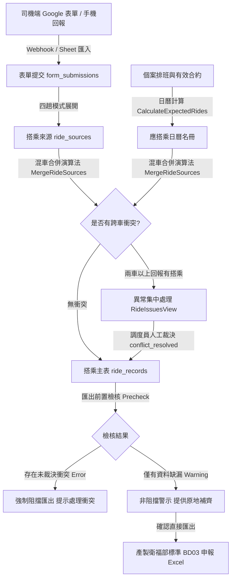
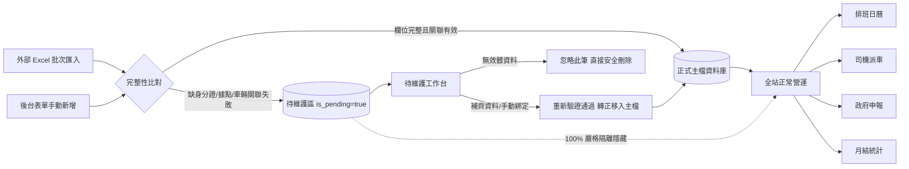

# 長照交通接送系統：產品規格、實體模型與業務邏輯手冊
**Product Specifications, Entity Relationships & Business Logic Handbook**

本文件參照專案最新架構與業務營運實務撰寫，統整資料結構、實體關聯基數（Cardinality）、主外鍵映射，以及全系統各功能模組之操作入口、輸入欄位、業務規則與防呆機制，旨在讓後端、前端與測試開發人員能夠迅速掌握系統核心架構與約束。

---

## 一、實體關係與資料模型規範 (Entity Relationship & Data Model Specification)

### 1.1 核心實體關聯對照表

| 主要實體 (Primary Entity) | 關聯名稱 (Relationship) | 目標實體 (Target Entity) | 關聯基數 (Cardinality) | 主外鍵對應 (Key Mapping) | 核心業務約束與防呆規則 (Business Constraints & Validation) |
|---|---|---|---|---|---|
| **司機 (Driver)** | 綁定駕駛車輛 | **車輛 (Vehicle)** | **N:1 (多對一)** | `driver_assignments.driver_id -> drivers.id`<br>`driver_assignments.vehicle_id -> vehicles.id` | 【核心規範】每位司機在同一生效區間內**僅能綁定單一主要車輛**；資料庫透過 GiST 排他約束（`no_overlapping_driver_assignment`）防止重疊指派。下拉選單僅能單選有效執照與保險之車輛。 |
| **車輛 (Vehicle)** | 指派執勤司機 | **司機 (Driver)** | **1:N (一對多)** | `vehicles.id <- driver_assignments.vehicle_id` (反向聚合) | 【核心規範】單一車輛可同時指派多位合格司機輪替駕駛（支援早晚班、平日/假日或代班司機輪班派車）。車輛端無唯一限制，反向關聯可查得該車所有合格司機。 |
| **車輛 (Vehicle)** | 指派服務路線 | **據點 (Site / Location)** | **1:N (一對多)** | `case_schedules.vehicle_id -> vehicles.id`<br>`schedule_legs.vehicle_id -> vehicles.id` | 同一車輛/車次可負責往返多個據點路線（如竹1、竹2、竹3車次接送所屬據點個案）。車輛本身的 `site_name` 僅為自由文字備註，不強關聯據點主檔。 |
| **個案 (Client / Case)** | 所屬日間據點 | **據點 (Site / Location)** | **N:1 (多對一)** | `cases.site_id -> sites.id`<br>(備援欄位: `cases.site_name_raw`) | 個案必須綁定有效營運據點（`POST /cases` 時 `siteId` 為必填）。若 Excel 匯入時名稱比對不到主檔，寫入 `site_name_raw` 並觸發 `site_pending = true` 進入待維護隔離。 |
| **個案 (Client / Case)** | 主責照護人員 | **照護人員 (Caregiver)** | **N:1 (多對一)** | `cases.caregiver_id -> caregivers.id` | 每位個案必須指定一位主責照護人員（新增個案時為必選），負責日常照顧協調、定期評估與目標追蹤。受 `ON DELETE RESTRICT` 保護，被指派之照護人員禁止直接物理刪除。 |
| **個案 (Client / Case)** | 去/回程接送車輛 | **交通偏好 (Transport Pref)** | **1:1 (專屬偏好)** | `case_transport_preferences.case_id -> cases.id` (一對一 PK)<br>`outbound_vehicle_id -> vehicles.id`<br>`inbound_vehicle_id -> vehicles.id` | 個案可分別指定去程車輛與回程車輛（例如去程搭竹3、下午回程搭竹1）；若指定車輛比對不到主檔則標記 `link_pending = true` 進入待維護隔離。 |
| **個案 (Client / Case)** | 排班計畫設定 | **排班計畫 (Case Schedule)** | **1:N (區間歷史)** | `case_schedules.case_id -> cases.id` | 單一個案在同一日期區間僅能有一筆有效排班計畫（GiST 排他約束 `no_overlapping_case_schedule`）。排班內定義服務天數、趟次模式（1/2/4趟）、基本單價（預設115元）與里程。 |
| **排班計畫 (Case Schedule)** | 趟次時段明細 | **趟次時段 (Schedule Leg)** | **1:N (1~4 趟)** | `schedule_legs.schedule_id -> case_schedules.id` | 依趟次模式定義 1~4 趟服務時段（去程/回程、上午/下午、出發時間、抵達時間、車次編號）。唯一約束 `(schedule_id, leg_seq)`。 |
| **司機回報 (Form Submission)** | 司機接送匯報 | **搭乘來源 (Ride Source)** | **1:N (多筆明細)** | `form_submissions.id <- ride_sources.submission_id` | 司機每日提交 Google 表單/匯入檔，解析每位個案與趟次之實際搭乘狀態（`boarded` 有坐 / `absent` 沒坐）。支援四趟制自動展開（Leg 1/3 去程、Leg 2/4 回程）。 |
| **搭乘來源 (Ride Source)** | 混車合併比對 | **搭乘主表 (Ride Record)** | **N:1 (多源合併)** | `ride_records.(case_id, service_date, leg_seq)` 唯一槽位 | 依「混車合併演算法」比對同一槽位多筆來源：多車回報有搭乘時標記 `has_conflict = true`（跨車衝突）。人工裁決或手動更正具最高優先級，新回報不得覆蓋人工結果（保護規則）。 |
| **搭乘主表 (Ride Record)** | 長照申報匯出 | **政府申報 (Gov Export)** | **1:1 (一對一轉換)** | `export_lines.case_id -> cases.id`<br>`service_date_roc` + `line_no` | 將有效乘車紀錄轉換為衛福部標準長照核銷申報格式（`BD03` 交通接送碼），核算基本單價、補助額度與自付額。未裁決衝突強制阻擋匯出；缺資料欄位採非阻擋原則留白產出。 |
| **系統使用者 (User)** | 角色與權限分配 | **角色 (Role)** | **N:1 (多對一)** | `users.role_id -> roles.id`<br>(備援自訂: `user_permission_overrides`) | 採用 RBAC 角色基礎存取控制，支援依模組（module）與操作（action: view/create/edit/delete/export）精細授權，並支援使用者層級之白名單覆蓋。 |

---

### 1.2 架構核心設計重點說明

```
┌────────────────────────────────────────────────────────────────────────┐
│                        【架構設計重點】核心約束機制                      │
└────────────────────────────────────────────────────────────────────────┘

● 司機 ➔ 車輛：多對一 (N:1) 關係
  - 每位司機在系統中同時間僅能綁定「1 輛主要執勤用車」（司機為主體單選車輛）。
  - 後端資料表 `driver_assignments` 採用 PostgreSQL GiST 排他約束（`driver_id` + `effective_range`），保證同一位司機的服務時段絕對不重疊。
  - 當司機調度改派新車時，系統自動將原車指派區間收合，確保權責清晰。

● 車輛 ➔ 司機：一對多 (1:N) 關係
  - 單一車輛可同時存在多位合格司機名單（車輛為載體，支援早晚班輪替、平日/假日輪替或代理司機調度）。
  - 車輛資料表本身不設駕駛單一唯一約束，透過 `driver_assignments` 反向聚合查出當前所有授權駕駛。

● 個案 ➔ 據點與照護人員：強外鍵實體關聯 (N:1)
  - 個案主檔直接關聯服務據點（`cases.site_id -> sites.id`）與主責照護人員（`cases.caregiver_id -> caregivers.id`），確保照護追蹤與日常派車責任到人。
  - 避免車輛或照護人員因自由文字異動造成歷史長照申報脫鉤。

● 待維護全站嚴格隔離機制 (Strict Full-Site Isolation)
  - 當個案必填缺失（`profile_pending`）、據點比對失敗（`site_pending`）或去回程車輛比對失敗（`link_pending`）時，視圖 `case_pending_status` 自動將其判定為 `is_pending = true`。
  - 待維護資料自排班日曆、派車名冊、趟次統計、月結報表及政府申報中 100% 全面隔離，僅允許在「待維護工作台」補正轉正或直接移除。

● 混車合併保護機制與非阻擋申報原則
  - 司機匯報若發生兩台車同時回報載到同一位個案，系統自動標記跨車衝突（`has_conflict = true`）。
  - 經調度員人工裁決（`conflict_resolved_at`）後，鎖定最終承載車輛與司機，後續新上傳之表單僅作審計留存，絕對不得覆蓋人工裁決。
  - 政府申報匯出執行「前置檢核」，未裁決衝突屬於硬性阻擋（Error），個案資料缺漏屬於柔性警示（Warning），落實非阻擋原則，保障行政請款時效。
```

---

## 二、系統功能詳細規格、業務邏輯與防呆核檢規範 (Functional Specifications & Business Logic)

| 系統模組 (Module) | 規格項目 (Feature) | 操作觸發 / 入口 (Trigger / Entry) | 主要輸入欄位 (Input Fields) | 核心業務邏輯說明 (Business Logic & Workflow) | 系統防呆與檢核機制 (System Validation & Guardrails) | 對應工作表/資料源 (Source Sheet / DB Table) | 角色權限 (Role Permission) | 開發優先級 (Priority) | 實作狀態 (Status) |
|---|---|---|---|---|---|---|---|---|---|
| **司機管理** | 司機新增與資料維護 | 後台選單 > 司機管理 > 新增/編輯司機 | 司機姓名、身分證字號、聯絡電話、駕照類別（職業小型車/大貨車/大客車/聯結車）、駕照到期日、指派車輛、備註 | 建立與維護司機基本檔案。司機身分證採 AES-256 加密儲存並產製 HMAC 索引與遮罩（前3後4碼）。駕照類別與有效日期供政府「服務駕駛清冊」申報備查。 | 1. 身分證字號長度10碼、首碼英文字母、首數碼性別驗證及加權檢查碼防呆；<br>2. HMAC 查重防重複建檔（`DUPLICATE_NATIONAL_ID`）；<br>3. 駕照類別限合規列舉（`sedan`/`truck`/`bus`/`trailer`）；<br>4. 新增時若有指定車輛，自動建立指派關聯。 | `drivers`<br>`driver_assignments` | 系統管理員 / 站長 | P0-核心 | 已實作 |
| **司機管理** | 司機綁定單一車輛 | 司機管理 > 司機列表「指派」按鈕 | 司機 ID、目標車牌號碼、生效起始日 | 【關鍵業務約束】每位司機在系統中僅能綁定「單一主要車輛」作為執勤用車，便於排班、責任歸屬與趟數計算。 | 1. 下拉選單僅單選已建檔且狀態為啟用之車輛；<br>2. 司機若已有執勤中車輛，自動收合原車指派之 `effective_range` 上界至新生效日；<br>3. 資料庫 GiST 排他防跨時段重疊。 | `driver_assignments`<br>`vehicles` | 系統管理員 / 站長 | P0-核心 | 已實作 |
| **司機管理** | 司機解除車輛指派 | 司機管理 > 司機列表「解除指派」按鈕 | 司機 ID | 司機請假、離職或車輛進行長假保養時，由管理員手動解除車輛綁定，釋出司機狀態。 | 1. 操作前二次確認對話框提示業務影響；<br>2. 後端將當前有效之指派區間上界收合至當前日期，尚未生效的未來指派直接物理刪除。 | `driver_assignments` | 系統管理員 / 站長 | P0-核心 | 已實作 |
| **司機管理** | 司機敏感身分證解密檢視 | 司機管理 > 司機明細「查看明文」 | 司機 ID、操作者密碼/二次驗證 | 司機身分證明文平日全域以遮罩顯示（如 `A12***7890`）。因應主管機關稽查或保險造冊需要時，授權人員得解密檢視。 | 1. 嚴格權限控管（需具備 `masters_drivers:edit` 權限）；<br>2. 點擊後完整寫入 `audit_log` 稽核日誌（記錄操作者、時間、IP、使用者代理）。 | `drivers`<br>`audit_log` | 系統管理員 | P1-高 | 已實作 |
| **車輛管理** | 車輛新增與執照/保險維護 | 後台選單 > 車輛管理 > 新增/編輯車輛 | 車牌號碼、車輛廠牌、型號、出廠年月 (YYYY-MM)、強制險到期日、第三人責任險到期日、乘客險到期日、驗車日期、是否符合輪椅載運、所屬單位(自由文字)、備註 | 登記長照營運交通車輛，維護長照服務車輛清冊必填資訊，建立保險效期追蹤機制。車輛資料更新採整筆覆寫（Full Replace）以維護資料一致性。 | 1. 車牌號碼全系統唯一性檢驗，不允許重複登記；<br>2. 出廠年月格式限制（`ck_vehicle_manufacture_ym`）；<br>3. 四大日期欄位（保險、驗車）嚴格檢驗西元有效日期；<br>4. 單位欄位採文字登記，不綁死據點主檔。 | `vehicles` | 總務專員 / 系統管理員 | P0-核心 | 已實作 |
| **車輛管理** | 車輛綁定多位司機 (反向指派) | 車輛管理 > 車輛列表「指派司機」/ 司機檢視 | 車輛 ID、司機清單（多選） | 【關鍵業務約束】同一輛公務車輛可被多位合格司機輪替駕駛（支援早晚班、平日/假日代班調度）。車輛檢視頁自動聚合顯示當前綁定至該車之所有司機。 | 1. 加入新司機時，系統自動將該司機在其他舊車上尚未結束的指派收合至生效日；<br>2. 列表直觀標示主要司機姓名與聯絡電話；<br>3. 停用之司機禁止加入指派名單。 | `vehicles`<br>`driver_assignments` | 排班主管 / 站長 | P0-核心 | 已實作 |
| **車輛管理** | 車輛執照保險與驗車預警 | 車輛管理列表 / 總覽儀表板 | 系統自動比對到期日 | 系統自動計算各車輛保險與驗車之剩餘有效天數，輔助總務提前安排驗車與保險續約作業。 | 1. 到期日前 30 天內標記黃色預警提示（`Warning`）；<br>2. 到期日已過標記紅色嚴重警告（`Danger`）；<br>3. 逾期車輛於派車與排班下拉選單中明確顯示警示標記。 | `vehicles` | 總務專員 / 站長 | P1-高 | 已實作 |
| **車輛管理** | 車輛停用與狀態管理 | 車輛管理 > 狀態切換 Switch | 車輛 ID、停用/啟用狀態 | 車輛報廢、重大維修或合約終止時進行停用。停用後自即時派車選單中剔除，但歷史趟數報表與政府申報紀錄完整留存。 | 1. 切換停用前跳出二次確認視窗說明影響；<br>2. 軟刪除與停用嚴格分流：停用（`inactive`）保留歷史報表；刪除（`deleted_at`）全站抹除。 | `vehicles` | 系統管理員 | P0-核心 | 已實作 |
| **據點管理** | 據點基本資料維護 | 後台選單 > 據點管理 > 新增/編輯據點 | 據點名稱、行政區域、營運地址、聯絡人、聯絡電話、備註 | 定義長照服務日間照顧站點，作為交通車接送行程之端點與長照核銷申報之地點基底。 | 1. 據點名稱與行政區聯合唯一性校驗（`uq_site_name_region`）；<br>2. 營運地址為必填；<br>3. 據點開放星期改由個案排班自定，解除據點綁定限制。 | `sites` | 營運主管 / 系統管理員 | P1-高 | 已實作 |
| **據點管理** | 據點停用與個案關聯防呆 | 據點管理 > 狀態切換 Switch | 據點 ID、目標狀態 | 據點停止營運或遷址時執行停用。若尚有個案歸屬於該據點，系統提出預警提示。 | 1. 停用時前端檢查目前關聯之個案在案人數並主動提示警告；<br>2. 停用後，新增個案與編輯個案選單中自動隱藏該據點；<br>3. 歷史趟次紀錄維持關聯顯示。 | `sites`<br>`cases` | 營運主管 / 系統管理員 | P1-高 | 已實作 |
| **照護人員管理** | 照護人員資料與單位維護 | 後台選單 > 照護人員 > 新增/編輯 | 照護人員姓名、職能類型（居服員/社工/個管/站長）、所屬單位(自由文字)、聯絡電話、備註 | 登記照護專業團隊成員，負責維護個案服務計畫。所屬單位為文字欄位，不影響排班與待維護機制。 | 1. 姓名為必填，系統自動建立正規化姓名防重；<br>2. 職能類型支援彈性選填（相容舊制）；<br>3. 姓名未填寫時會被標記為待維護個案。 | `caregivers` | 督導 / 系統管理員 | P1-高 | 已實作 |
| **照護人員管理** | 照護人員停用與個案保護 | 照護人員 > 狀態開關 / 刪除 | 照護人員 ID | 照護人員離職時執行停用。受外鍵約束保護，已被個案指派為負責人之照護人員禁止直接物理刪除。 | 1. 資料庫 `cases.caregiver_id` 設有 `ON DELETE RESTRICT` 限制；<br>2. 欲刪除前必須先至個案管理將主責人員轉移至其他在職照護人員。 | `caregivers`<br>`cases` | 系統管理員 | P1-高 | 已實作 |
| **個案管理** | 個案創資與身分核准 | 後台選單 > 個案管理 > 新增個案 | 個案姓名、身分證字號、身分別、戶別（一般戶/中低收/低收）、性別、出生日期、服務類別、服務使用類型、申報起訖日、所屬據點、主責照護人員、住家地址、戶籍地址、緊急聯絡人 | 建立受照護個案主檔，核定長照補助資格。身分證經 AES-256 加密與 HMAC 索引，年齡依出生日期動態推算。所屬據點與主責照護人員為必填項。 | 1. 身分證字號10碼、首碼英文字母、加權校驗碼及重複防呆（`DUPLICATE_NATIONAL_ID`）；<br>2. 戶別設定影響後續自負額比率（一般戶自付16%~20%、中低收5%、低收0%）；<br>3. 所屬據點與照護人員必須選自啟用中主檔。 | `cases`<br>`sites`<br>`caregivers` | 社工員 / 個管師 | P0-核心 | 已實作 |
| **個案管理** | 個案交通偏好設定 | 個案管理 > 個案編輯 > 交通偏好分頁 | 去程指定車輛、回程指定車輛、上車地點、下車地點、特殊需求（輪椅/陪同者） | 指定個案每日去程與回程之固定搭乘車輛（支援去回程不同車，如上午搭竹3、下午搭竹1），作為每日排班生成之基準依據。 | 1. 指定車輛必須為啟用中之有效車輛；<br>2. 若指定之車牌不存在或被刪除，自動標記 `link_pending = true` 進入待維護隔離；<br>3. 輪椅個案標註用於車輛輪椅位超載防呆。 | `case_transport_preferences`<br>`vehicles` | 個管師 / 排班專員 | P0-核心 | 已實作 |
| **個案管理** | 個案停用、結案與軟刪除 | 個案管理 > 狀態切換 / 刪除 | 個案 ID、變更狀態 (啟用/暫停/結案/刪除) | 管理個案服務生命週期。暫停或結案之個案自排班日曆中排除，不再產生新應搭紀錄，但歷史核銷報表完整保留。 | 1. 軟刪除（`deleted_at IS NOT NULL`）僅用於測試資料或建錯資料，會自全站歷史報表抹除；<br>2. 營運異動一律使用「暫停/結案（`inactive`/`closed`）」，保證申報與月結歷史資料完整。 | `cases` | 社工督導 / 系統管理員 | P0-核心 | 已實作 |
| **班表管理** | 個案固定排班與趟次設定 | 個案管理 > 排班設定 / 班表管理 | 排班有效區間 (起訖日)、搭乘星期 (週一至週日)、趟次模式 (1趟/2趟/4趟)、基本單價 (預設115元)、服務時長、單程里程數、去回程各 Leg 出發時間 | 建立個案長期性週期排班合約。系統支援一人多版本有效排班（歷史軌跡），並依趟次模式定義各時段出發時間與對應車輛。 | 1. 同一個案在相同日期區間內禁止排班重疊（`no_overlapping_case_schedule` GiST 約束）；<br>2. 出發時間不得晚於抵達時間；<br>3. 單價必須大於0；每趟次序號具備唯一性。 | `case_schedules`<br>`schedule_legs` | 排班專員 / 個管師 | P0-核心 | 已實作 |
| **班表管理** | 應搭日曆展開計算 | 系統背景排程 / 搭乘月曆畫面載入 | 目標月份、地區/據點條件 | 系統依演算法推算個案該月份所有「應搭乘紀錄」作為與司機匯報比對之基準。判斷條件：<br>1. 當天星期落在排班星期內；<br>2. 落在個案申報起訖日內；<br>3. 落在排班有效區間內；<br>4. 排除政府國定假日。 | 1. 國定假日自 `settings_holidays` 資料表自動過濾排除；<br>2. 週日依標準編碼為 7；<br>3. 通過全部檢核之日期展開所有 Legs（去程/回程）形成期待搭乘清單。 | `domain/calendar`<br>`case_schedules`<br>`holidays` | 系統排程 / 營運人員 | P0-核心 | 已實作 |
| **司機接送匯報** | Google 表單與 Webhook 串接 | 司機接送匯報 > 批次上傳 / 表單註冊 | 車牌號碼、Google 表單 ID、Webhook 金鑰、服務日期、原始回報文字 | 司機出車後透過手機填寫 Google 表單回報接送名冊與搭乘情況。系統透過 Webhook 即時接收或批次匯入 Sheet 紀錄。 | 1. 表單 ID 全域唯一防呆；<br>2. 司機姓名採 Unicode NFKC 正規化、去除空白、去雜訊後進行異體字與編輯距離比對；<br>3. 同一車輛當日回報依提交時間取最新一筆。 | `google_forms`<br>`form_submissions` | 司機 / 排班員 | P0-核心 | 已實作 |
| **司機接送匯報** | 匯報四趟制自動展開 | 匯報資料處理管線 | 表單提交紀錄之搭乘欄位 (Leg 1, Leg 2) | 當個案排班模式設定為「四趟制」（`TripPattern == 4`，如去程分上下車兩欄）時，系統自動將司機填寫之第 1 趟映射為 Leg 1 與 Leg 3，第 2 趟映射為 Leg 2 與 Leg 4。 | 1. 非四趟制排班嚴格維持 1:1 對齊，不進行展開；<br>2. 展開紀錄分別寫入 `ride_sources`，標記個案搭乘狀態（`boarded`/`absent`）。 | `ride_sources`<br>`case_schedules` | 系統核心管線 | P0-核心 | 已實作 |
| **搭乘紀錄管理** | 混車合併演算法與跨車衝突偵測 | 系統核心管線 / 匯報寫入後自動觸發 | 同一槽位 `(case_id, service_date, leg_seq)` 之多筆 `ride_sources` | 彙整不同車輛對同一個案同趟次回報。同車取最新回報；任一車回報有坐即判定 `boarded`；若兩台以上不同車輛同時回報「有坐」，觸發跨車衝突（`has_conflict = true`）。 | 1. 自動推導承載車輛：有坐取最早回報之車輛（第一線真實情況）；<br>2. 跨車衝突立即推送至「異常集中處理」工作台；<br>3. 系統產生專屬衝突特徵值防止併發覆蓋。 | `ride_records`<br>`ride_sources` | 系統核心管線 | P0-核心 | 已實作 |
| **搭乘紀錄管理** | 異常集中處理 (跨車衝突人工裁決) | 搭乘與排程 > 異常集中處理頁面 | 衝突紀錄 ID、裁決承載車輛、裁決司機、裁決備註 | 調度員調查個案實際搭乘車輛後進行人工裁決。裁決結果寫入 `conflict_resolved_at` 與 `conflict_resolved_by`。 | 1. 【核心保護規則】一旦完成人工裁決，後續任何新匯入之司機表單一律不得覆蓋裁決結果；<br>2. 若後續來源狀態變更，標記 `source_changed = true` 提示調度員。 | `ride_records`<br>`audit_log` | 排班專員 / 站長 | P0-核心 | 已實作 |
| **搭乘紀錄管理** | 搭乘月曆檢視與手動更正 | 搭乘與排程 > 搭乘月曆表 | 個案 ID、服務月份、目標趟次、更正狀態、更正車輛、更正司機、更正原因 | 月曆直觀呈現每日去回程搭乘狀態（已搭乘/缺席/未回報/異常衝突）。調度員可點擊任一儲存格就地更正搭乘狀態與派車。 | 1. 手動更正必填「更正原因」並記錄操作者 ID；<br>2. 人工更正具備鎖定保護，不受後續匯入覆蓋；<br>3. 支援即時更新統計趟數。 | `ride_records`<br>`audit_log` | 排班專員 / 個管師 | P0-核心 | 已實作 |
| **搭乘紀錄管理** | 未回報清單偵測與催報 | 搭乘與排程 > 未回報清單 | 服務日期範圍、車輛/據點篩選 | 系統自動比對「應搭日曆」與「實際匯報」，列出排定應搭卻完全未收到司機回報之班次名冊，支援一鍵發送催報提醒。 | 1. 排除國定假日與已請假個案；<br>2. 催報記錄寫入歷史通知日誌，防止同一司機短時間內重複受到密集干擾。 | `ride_records`<br>`notification_deliveries` | 排班專員 / 營運主管 | P1-高 | 已實作 |
| **待維護資料機制** | 待維護判定與全站嚴格隔離 | 系統資料寫入與匯入時自動觸發 | 個案資料（缺少身分證/姓名/據點/去回程車輛無效） | 當主檔或匯入資料缺少關鍵必填，或外鍵關聯比對失敗時，視圖 `case_pending_status` 自動判定為待維護（`is_pending = true`）。 | 1. 【全站嚴格隔離鐵律】待維護個案絕對禁止出現在正常個案列表、排班日曆、司機派車表、月結報表及政府申報中；<br>2. 所有查詢強制 JOIN 待維護視圖並過濾。 | `cases`<br>`case_pending_status` | 系統底層守則 | P0-核心 | 已實作 |
| **待維護資料機制** | 待維護工作台就地補齊轉正 | 待維護工作台 / 個案管理待維護頁籤 | 待維護紀錄 ID、補齊之據點/車輛/必填欄位 | 作業人員於待維護專屬工作台逐筆或批次補齊缺失欄位，確認後轉正為全系統可用資料。 | 1. 儲存時系統重新執行全欄位驗證；<br>2. 驗證通過後自動清除 `is_pending` 標記，即時解鎖全站可見度；<br>3. 支援「忽略此筆」按鈕，直接自資料庫硬刪除垃圾資料。 | `cases`<br>`case_transport_preferences` | 個管師 / 系統管理員 | P0-核心 | 已實作 |
| **長照申報匯出** | 申報匯出前置檢核 | 政府申報匯出 > 選擇申報年月與地區 > 點選「匯出」 | 申報年月 (YYYY-MM)、行政區域 | 系統產製申報檔案前，自動執行三大檢核：<br>1. 配給額度檢查（`info`）；<br>2. 個案資料缺失（`warning`，缺身分證/地址等）；<br>3. 未裁決跨車衝突（`error`）。 | 1. 【硬性阻擋】若存在未裁決之跨車衝突，`Passed = false`，系統嚴格阻擋匯出並引導至異常集中處理頁面；<br>2. 【非阻擋原則】若僅為資料缺失（Warning），系統僅作視覺化警示，不阻擋匯出。 | `export_jobs`<br>`ride_records`<br>`cases` | 營運主管 / 行政專員 | P0-核心 | 已實作 |
| **長照申報匯出** | 匯出非阻擋與快捷修正 | 匯出預覽對話框 | 快捷跳轉連結 / 原地修正輸入 / 確認直接匯出 | 匯出檢核視窗明確列出缺漏之個案與欄位，提供「原地設定」或「跳轉編輯」修復管道；使用者亦可選擇「忽略提示，直接依照現況完整匯出」。 | 1. 非阻擋原則：嚴禁因欄位缺漏跳出禁止匯出錯誤，按鈕保持可用；<br>2. 缺漏欄位於申報檔案中依規格留白產出；<br>3. 系統自動記錄資料缺口清單（Data Gaps）。 | `export_jobs`<br>`export_lines` | 營運主管 / 行政專員 | P0-核心 | 已實作 |
| **長照申報匯出** | 衛福部標準 BD03 申報檔產製 | 系統後端匯出排程任務 | 匯出工作 ID、核銷明細資料 | 依衛福部 33 欄長照交通接送標準格式產出 `.xlsx` 試算表。排序規則：<br>1. 個案身分證字典序；<br>2. 趟次序號升冪；<br>3. 去程（outbound）優先於回程（inbound）；<br>4. 服務日期升冪。 | 1. 嚴格輸出純 `.xlsx` 格式，嚴禁產製 CSV；<br>2. 系統未介接之欄位（如復能C碼、送餐OT01、經緯度）一律留白，嚴禁程式臆測代填；<br>3. 產出檔案計算校驗雜湊值。 | `export_jobs`<br>`export_lines`<br>`domain/govform` | 系統後端排程 | P0-核心 | 已實作 |
| **報表與統計** | 車輛趟數月結表匯出 | 報表與統計 > 車輛趟數表 | 統計年月 (YYYY-MM) | 統計全車隊各車輛於該月份之總出車趟數、有效載客數、空趟數及出勤率，作為車輛營運效能分析依據。 | 1. 僅統計有效乘車紀錄，排除已軟刪除車輛；<br>2. 處於「停用」狀態之車輛若該月有歷史趟次，依規保留顯示，不得歸零；<br>3. 提供一鍵下載標準 Excel 報表。 | `reports_trip_summary`<br>`ride_records` | 營運主管 / 站長 | P1-高 | 已實作 |
| **車輛營運維護** | 出勤與油資登錄 | 車輛營運 > 出勤與油資登錄 | 車牌號碼、加油日期、加油公升數、發票金額、當前里程數、出勤司機、發票號碼、備註 | 登記車輛日常出勤哩程與油料花費，追蹤車隊每公里耗油成本，異常油耗即時警示。 | 1. 里程數防呆：輸入里程不得小於該車歷史最後登錄里程；<br>2. 加油金額與公升數必須大於0；<br>3. 發票號碼格式驗證。 | `attendance_fuel` (業務表) | 司機 / 總務專員 | P2-中 | 已實作 |
| **系統安全與設定** | 帳號登入與密碼安全原則 | 系統登入頁面 (`/login`) | 使用者帳號 (Email)、密碼 | 提供系統操作人員身份驗證，核發雙軌 JWT Access/Refresh Token。全面實施密碼安全性強度校驗。 | 1. 密碼長度 8~64 字元，必須包含大小寫英文字母、數字及特殊符號；<br>2. 連續 3 碼相同或連續遞增/遞減字元防呆；<br>3. 密碼雜湊採用 bcrypt，登入失敗次數過多啟動防禦鎖定。 | `users`<br>`auth_tokens` | 全體人員 | P0-核心 | 已實作 |
| **系統安全與設定** | 角色身分與模組權限矩陣 | 系統設定 > 角色身分管理 | 角色名稱、模組授權勾選表 (View / Create / Edit / Delete / Export) | 管理各作業角色（如系統管理員、站長、排班專員、個管師、司機）之全系統模組權限。後端 API 路由與前端路由守衛 100% 同步校驗。 | 1. 核心「系統管理員」角色受保護禁止刪除；<br>2. 前端路由守衛依 `meta.module` 即時攔截無權限訪問；<br>3. 後端 Gin 路由掛載 `RequirePermission` 雙重把關。 | `roles`<br>`role_permissions` | 系統管理員 | P0-核心 | 已實作 |
| **系統安全與設定** | 系統全操作稽核軌跡 (Audit Log) | 系統安全 > 系統操作紀錄 | 操作日誌篩選 (操作者、動作類別、實體類型、起訖時間) | 系統對所有主檔之新增、修改、刪除、敏感資料解密（Reveal）及衝突裁決進行完整快照留痕（Snapshot Before & After）。 | 1. 稽核日誌資料表（`audit_log`）為 Append-Only（僅允許 INSERT，嚴格禁止 UPDATE 與 DELETE）；<br>2. 自動記錄請求者 IP、User Agent 與交易時間戳。 | `audit_log` | 系統管理員 / 稽核員 | P0-核心 | 已實作 |

---

## 三、關鍵資料流與防呆架構圖解

### 3.1 司機接送匯報至長照申報全流程



### 3.2 待維護資料隔離與轉正生命週期



---

## 四、附錄：專案核心代碼與規範索引

1. **七大系統核心業務準則**：請參閱 [system-logic-specification.md](system-logic-specification.md)。
2. **後端演算法與商業規則（混車合併、申報排序、身分證密碼學）**：請參閱 [backend-business-rules.md](backend-business-rules.md)。
3. **後端完整 API 端點對照表**：請參閱 [backend-api-reference.md](backend-api-reference.md)。
4. **前後端整合契約規範**：請參閱 [integration-contract.md](integration-contract.md)。
5. **資料異動與稽核機制**：請參閱 [mutation-audit-specification.md](mutation-audit-specification.md)。
